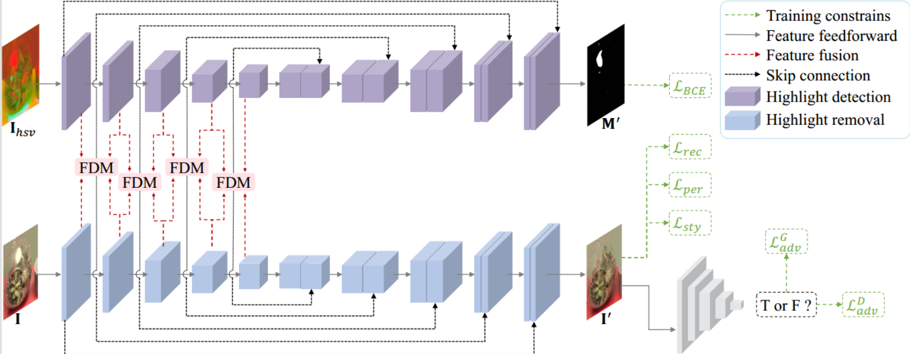
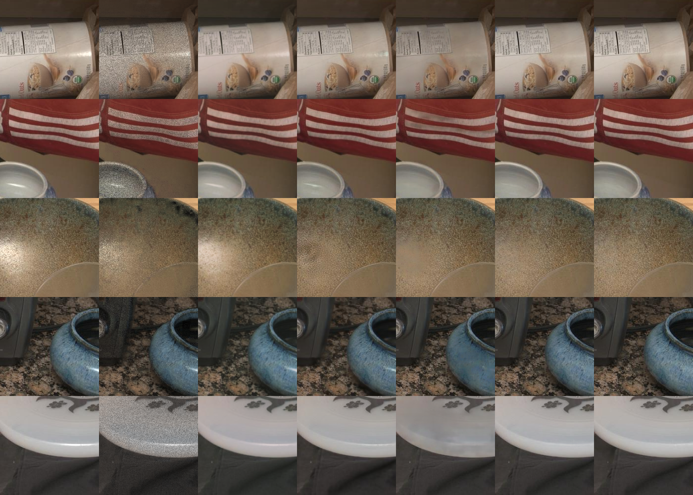

# A Mutual Enhancement Framework for Specular Highlight Detection and Removal

<p align="center">
<b>Framework
</p>
<p align="center">
    
</p>
    
<p align="center">
<b>Generated Images
</p>
<p align="center">
    
</p>


## Requirements
- Python 3.10.8 
- Pytorch 1.13.1

## Installation

Clone this repo.
```
git clone https://github.com/ErisGe/highlight-detection-and-removal.git
conda env create -f experiments.yaml
```

## Preparation
### Datasets
1. Download the preprocessed metadata for [SHIQ](https://github.com/fu123456/SHIQ) and extract them to `dataset/`
2. Download the [LIME](https://vcai.mpi-inf.mpg.de/projects/LIME/) image data. Extract them to `dataset/`
3. Download [SD1 & SD2 & RD](https://github.com/weizequan/tashr) dataset and extract the images to `dataset/`

## Training
  ```
  cd highlight-detection-and-removal
  ```
### Change configs
Change the parameters `dir_image`, `dir_test`, `image_size`, and `save_dir` in `utils/option.py`.
1. `dir_image` should be the file path of the training dataset, while `dir_test` means the file path of the test dataset.
2. Attention that `image_size` should be the same as the origin datasets size.
3. `save_dir` will store the models and logs.
4. You can change `batch_size` to whatever you can support but the performance cannot be ensured.

### Train the model

  ```
    python train.py --tensorboard --dir_image ./dataset/dataset_name/train --dir_test dataset/dataset_name/test/ --image_size dataset_size --save_dir ./experiments/
  ```

  - For example, SHIQ dataset:
  ```
    python train.py --tensorboard --dir_image ./dataset/SHIQ_data_10825/train --dir_test dataset/SHIQ_data_10825/test/ --image_size 200 --save_dir ./experiments/
  ```

### Resume training process
If your training process is interrupted unexpectedly, add `--resume` at the training command to resume training.

### TensorBoard
Our code supports automatic evaluation during training, the results are stored in TensorBoard files under `./experiments/model_name/log`.

## Testing

### Test the model

  ```
  cd highlight-detection-and-removal
  ```
Change the parameters `pre_train`, `dir_test`, and `outputs` in `test.py`.

  ```
  python test.py --pre_train ./model_path --dir_test ./dataset/dataset_name/test/ --outputs ./outputs/
  ```


---
### Citing 

The code is released for academic research use only.  If you find our code useful please consider citing:
```
@inproceedings{huang2023mutual,
  title={A Mutual Enhancement Framework for Specular Highlight Detection and Removal},
  author={Huang, Ge and Yao, Jieru and Huang, Peiliang and Han, Longfei},
  booktitle={Chinese Conference on Pattern Recognition and Computer Vision (PRCV)},
  pages={457--468},
  year={2023},
  organization={Springer}
}
```
